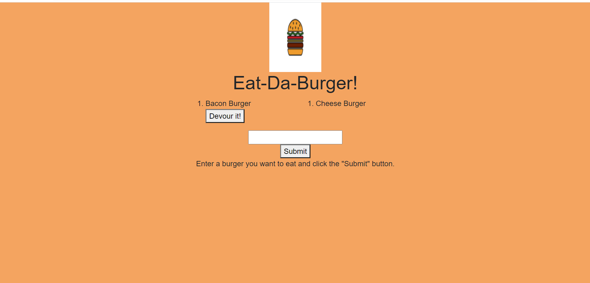

# burger

## Description

This application is a Full-Stack application built from scratch. It follows the MVC model to separate the job of each file. The user interface of the application is very simple. See below for the link to the deployed application in Heroku.

https://thawing-island-13237.herokuapp.com/

When you navigate to the page you are presented with the page instructing you to enter the name of a burger you want to eat and to click the submit button. After clicking the submit button the page will refresh and show you the entry on the top-left of the input box.

The entry will have a devour it button right next to it and the entry will switch to the right side without the button to indicate that the burger has been eaten. See below for a screenshot of the application.

The backend for the application is a bit more complicated. It starts with the views folder containing the main and index handlebars file. The main file contains the shell HTML code to build the page and the index file contains the code to show the user the lists, the input, and the submit button.

The public folder contains the CSS to style the page and the js folder which uses jquery to set up the listeners for the two buttons in the page. Next is the controllers folder which has the available routes depending on the request the controller received.

The models folder has the burger model which calls on the methods in the orm.js file to interact with the database. Last but not least, in the config folder the orm.js file is the one containing the methods and the code to communicate with the database.

## Table of Contents

* [Installation](#installation)
* [Usage](#usage)
* [License](#license)
* [Contributing](#contributing)
* [Tests](#tests)
* [Questions](#questions)

## Installation

The application uses three npm packages. Express, express-handlebars, and mysql. To install all three of them in a backend environment simply run npm install on the terminal of your choice.

## Usage

The application is primarily used to expose the developer to all the steps involved in building a full-stack application from scratch.

## License

[MIT](https://choosealicense.com/licenses/mit/)

## Contributing

Contributions are currently not accepted for this project.

## Tests

There is no testing available within the application.

## Questions

## Questions

My GitHub username is: chavalk

Link: https://github.com/chavalk

If you have additional questions, feel free to reach me at chavalk@hotmail.com.