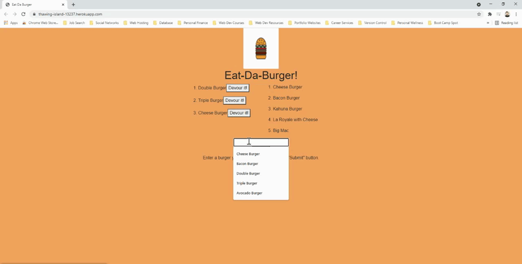

# Eat Da Burger

## Description

A full stack application that allows users to add a new burger to the list and to devour any of the burgers.

## What the project does

The project allows users to add different types of burgers to the list and to click a button to devour each one and have then be displayed in another list. Below is a GIF showing an interaction with the application.

## Why is the project useful

The project is useful mostly to allow me to build my first full stack application from scratch. For a user, the use is very simple, although, if you're looking for an easy way to keep track of your burgers, you've found the pefect app!

## How can users get started with this project

Simply navigate to the deployed version of the website by following the link below.

https://thawing-island-13237.herokuapp.com/

## What technologies were used with this project

* JavaScript
* Handlebars
* CSS
* Express
* MySQL
* Express-Handlebars
* Heroku

## Where can users get help with your project

My GitHub username is: chavalk

Link: https://github.com/chavalk

If you have additional questions, feel free to reach me at chavalk@hotmail.com.

## Who maintains and contributes to the project

Currently I'm the only person maintaining and contributing to the project.